EDA on Zomato Dataset in SSMS

# Introduction

SQL stands for Structured Query Language. It is the standard language to
interact with databases and a data analyst uses to manipulate and gain insights
from the data. For this project, I will try to process, and analyze the Zomato’s
Dataset from [Kaggle]
(<https://www.kaggle.com/datasets/rabhar/zomato-restaurants-in-india?resource=download>)

# Dataset

So now let’s get the **shape** of the data, this will return all the rows and
columns present in the table.

The dataset has **211944** rows and **27** columns.

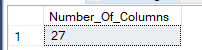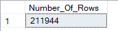

# Let’s answer some questions

Get top 10 cities with average cost for 2 people and also number of entries for
each city

### 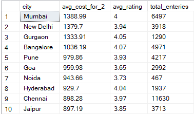

Get bottom 10 cities with average cost for 2 people and also number of entries
for each city

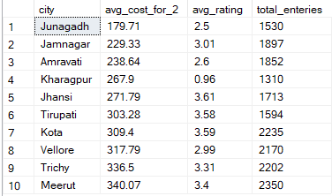

### Cities ranked as per the most number of locations Zomato is in operation

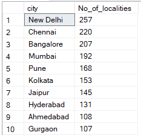

### Let’s check out the Top 10 restaurant chains

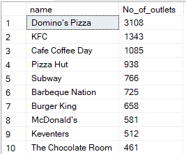

### Popular Casual Dining places and their ratings in Bangalore

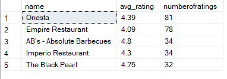

### Popular Bars and their ratings in Bangalore

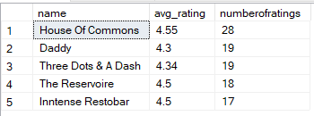

### Let’s check out the Top 10 restaurant chains in Bangalore

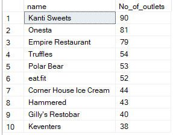

### Let’s check out the Top 10 establishments and ratings in Bangalore

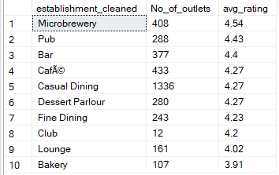

### where can we find the best Pizza in Bangalore, also those restaurants having at least 10 ratings given for them

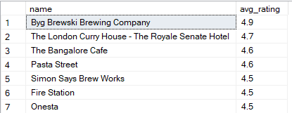

### Top rated Pure Veg restaurants in Bangalore, also those having at least 10 ratings given for them

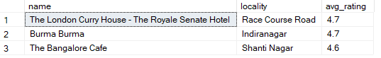
